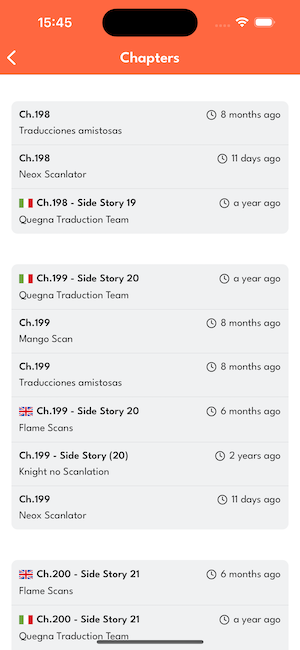
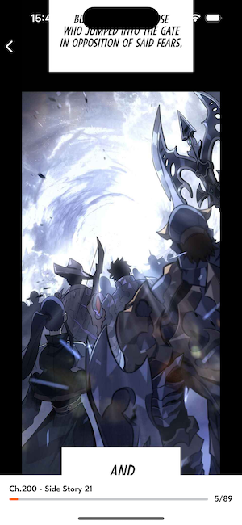

# MangaReader

MangaReader is a React Native mobile application that allows users to read manga from MangaDex. This app provides a clean and intuitive interface to browse, search, and read your favorite manga titles directly from your mobile device.

## About

MangaReader leverages the MangaDex API to bring you a vast library of manga content. The application is built using React Native, making it available for both iOS and Android platforms.

## Features

- Browse and search manga from MangaDex's extensive library
- View manga details including descriptions, authors, and tags
- Read manga chapters with a smooth reading experience

## Technology Stack

- React Native
- TypeScript
- React Navigation
- MangaDex API





## Installation

### Prerequisites

- Node.js
- React Native development environment setup
  - iOS: Xcode (for Mac users)
  - Android: Android Studio

### Setup

1. Clone the repository

```bash
git clone https://github.com/hirthbrian/MangaReader.git
cd MangaReader
```

2. Install dependencies

```bash
npm i
```

3. Install iOS dependencies (iOS only)

```bash
npx pod-install
```

4. Start the application

```bash
# For iOS
npm run ios

# For Android
npm run android
```

## Development

This project follows standard React Native development practices. It uses:

- ESLint and Prettier for code formatting
- TypeScript for type safety

## Legal Notice

This app is not affiliated with MangaDex. It is an unofficial client that uses the public MangaDex API. All manga content is provided by MangaDex and their content providers.

## License

MIT License

## Acknowledgements

- MangaDex for providing the API
- All contributors to this project

**Note**: This app is for personal use and learning purposes only.
